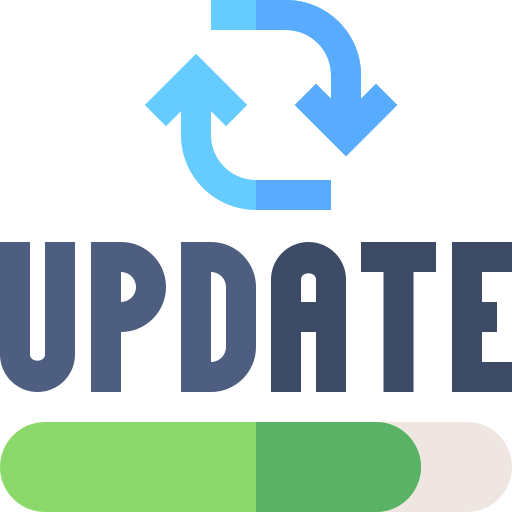

# <center> 

# <center> AutoUpdateApp </center>

## ✅ Download & use `mylib` for updating

make `version.py` file in root folder and add only two tags
```json
CURRENT_VERSION= "1.0.4"
REPO_URL="https://api.github.com/repos/mdhira-ai/AutoUpdateApp/releases/latest"
```

import mylib folder to your project. and use `check_for_updates` function to your update button.

import `version.py` and use `CURRENT_VERSION`to show current version.


check example folder for `inno setup compiler` script

make sure never change `AppId={{YOUR-UNIQUE-GUID-HERE}}`.only change version. and add this two line

```iss
CloseApplications=yes
RestartApplications=yes
```

## ℹ️ Future update

Will use OOP for mylib. and make `CURRENT_VERSION` as a method.

